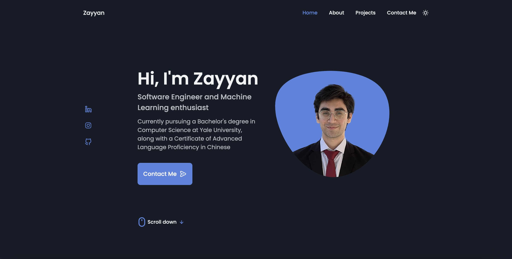
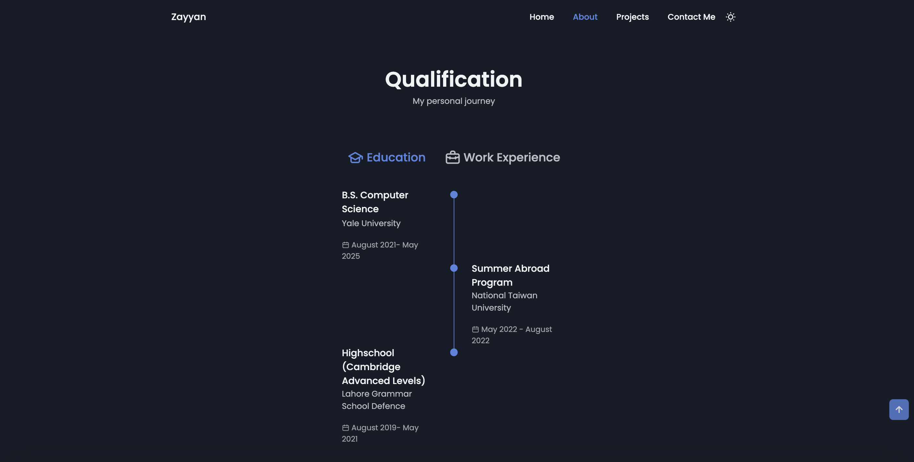
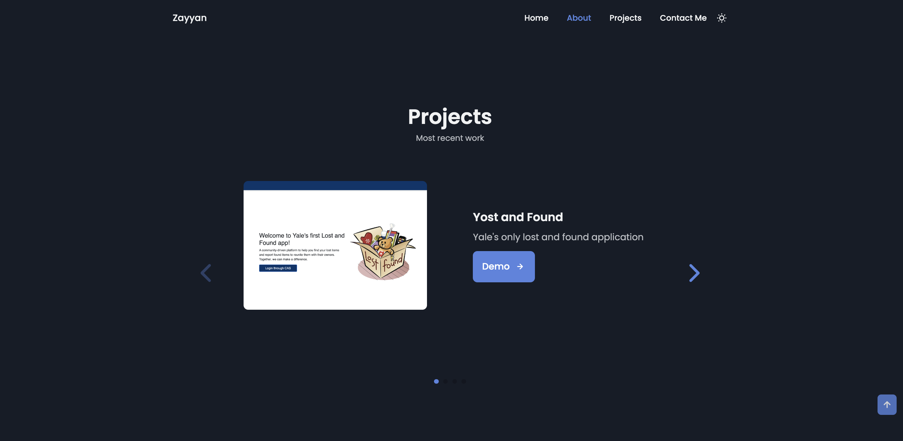
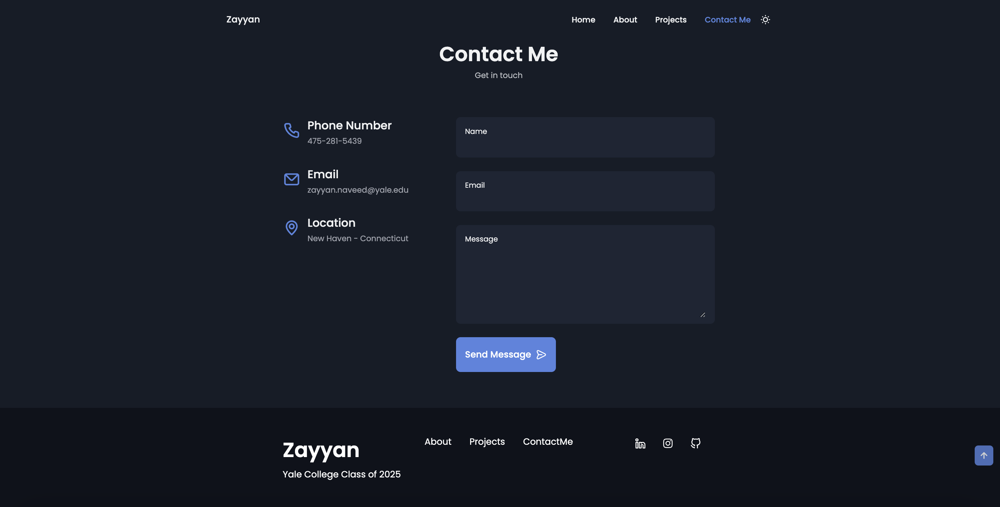

# Zayyan Naveed's Personal Website

Welcome to my personal website! You can visit the live site [here](https://zayyannaveed27.github.io/).

### Website Preview
#### Home Page

#### About Page

#### Projects Page

#### Contact Page

## Features 📋
⚡️ Fully Responsive\
⚡️ HTML CSS & JavaScript\
⚡️ Light and dark mode\
⚡️ Compatible with cross-width platforms

## Sections 📚
✔️ Home\
✔️ About\
✔️ Projects\
✔️ Contact\

## Tools Used 🛠️
* <b>GitHub Pages</b>

## License

- **[MIT license](http://opensource.org/licenses/mit-license.php)**

Feel free to explore my website, and don't hesitate to reach out to me if you have any questions or would like to collaborate on a project. Thank you for visiting! 😊
